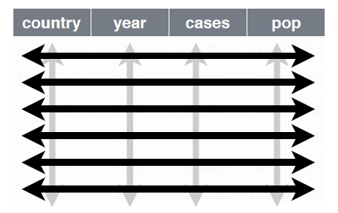
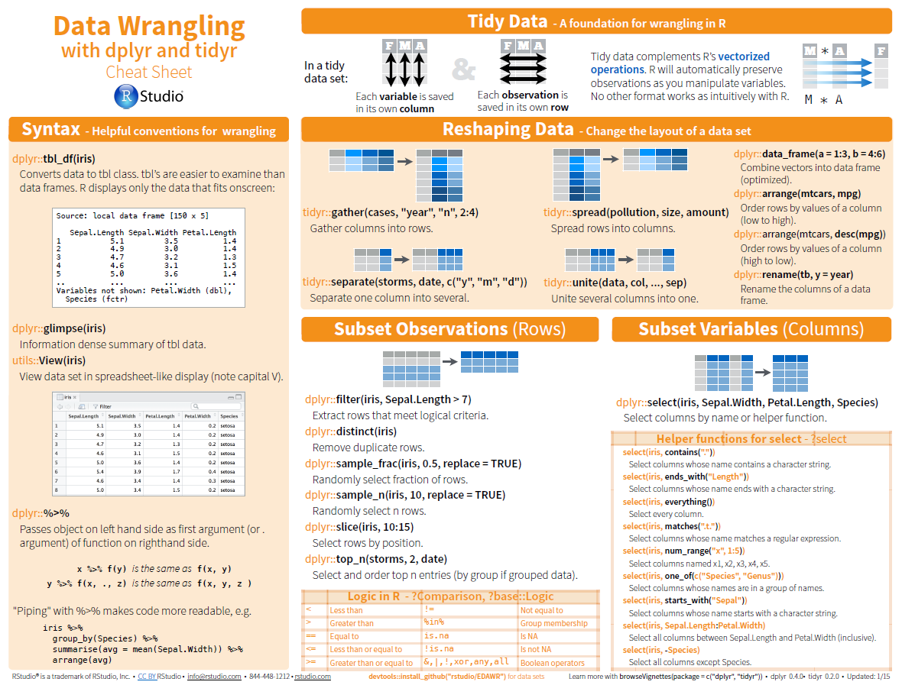

```{r setup, include=FALSE}
options(htmltools.dir.version = FALSE, scipen = 999)
knitr::opts_chunk$set(eval = FALSE)
```

background-image: url(http://hea.ie/assets/uploads/2017/04/DCU-1000x500.jpg)
background-size: 95%

<div class="tulsa-logo"></div> 
<div class="aacsb-logo"></div> 
<div class="dcu-logo"></div> 
<div class="dotlab-logo"></div> 

# Data Wrangling With dplyr

---
<div class="aacsb-logo"></div> 
<div class="dcu-logo"></div> 
<div class="dotlab-logo"></div> 

# R basic reminder

--

Create object with assigment arrow `<-`
* keyboard shortcut `Alt + -`

--

Run code with `Crtl + Enter`

--

dataframe is the most important object
* columns of different types (e.g., characters, numerics, ...)

--

functions are saved in packages
* `install.packages("PackageName")`
* `library(PackageName)`

--

functions have arguments defined with =

`FunctionName(arg1 = something, arg2 = somethingelse)`

--

Read data with `read.csv("path/to/file.csv")`

Write data with `write.csv(DataframeObjectName, "path/to/file.csv", row.names = FALSE)`

---
<div class="aacsb-logo"></div> 
<div class="dcu-logo"></div> 
<div class="dotlab-logo"></div> 

# The Tidyverse

A collection of modern R packages that share common philosophies, embed best practices, and are designed to work together.

An R package that serves as a short cut for installing and loading the components of the tidyverse.

```{r}
install.packages("tidyverse")
# can take time to download and install beause many package are included

library(tidyverse)
```

---
<div class="aacsb-logo"></div> 
<div class="dcu-logo"></div> 
<div class="dotlab-logo"></div> 

# The so called Tidy Data


.pull-left[



]

.pull-right[

A data set is **tidy** if:
1. Each **variable** is in its own **column**
2. Each **case** is in its own **row**
3. Each **value** is in its own **cell**

]

---
class: center, middle
<div class="aacsb-logo"></div> 
<div class="dcu-logo"></div> 
<div class="dotlab-logo"></div> 

# Data Wrangling with `dplyr` Package

---
<div class="aacsb-logo"></div> 
<div class="dcu-logo"></div> 
<div class="dotlab-logo"></div> 

# Get the data

Can be found here:
"https://raw.githubusercontent.com/damien-dupre/data/master/manager_satisfaction_performance_raw.csv"

Or here:
"https://bit.ly/2HvAuAO"

```{r}
data <- read.csv("https://bit.ly/2HvAuAO")
```

7 columns:
* managers = character "senior" or "junior",
* monthly.contract.negociated = numeric (average amount of contracts per month)
* job.satisfaction.Q1 = from 0 to 10
* job.satisfaction.Q2 = from 0 to 10
* job.satisfaction.Q3 = from 0 to 10
* job.satisfaction.Q4.reverse = from 0 to 10
* job.satisfaction.Q5 = from 0 to 10

---
<div class="aacsb-logo"></div> 
<div class="dcu-logo"></div> 
<div class="dotlab-logo"></div> 

# How to use `dplyr`?

```{r}
install.packages("dplyr")
library(dplyr)
```

dplyr has few very useful functions:

* `rename()` to rename a column
* `select()` to select certain columns of a dataframe
* `filter()` to filter certain rows of a dataframe
* `mutate()` to create new columns
* `group_by()` to analyse groups of data
* `summarise()` to create summary of data (mean, sd, ...)

---
<div class="aacsb-logo"></div> 
<div class="dcu-logo"></div> 
<div class="dotlab-logo"></div> 

# rename()

Arguments
1. Name of the dataframe object
2. NewColName = OldColName

Example

```{r}
# Basic
data_with_new_names <- rename(data, MCN = monthly.contract.negociated)

# Works as well
data_with_new_names <- rename(
  data,
  MCN = monthly.contract.negociated
  )

# Works with many columns at once
data_with_new_names <- rename(
  data,
  MCN = monthly.contract.negociated,
  JS_Q1 = job.satisfaction.Q1,
  JS_Q2 = job.satisfaction.Q2,
  JS_Q3 = job.satisfaction.Q3,
  JS_Q4_Rev = job.satisfaction.Q4.reverse,
  JS_Q5 = job.satisfaction.Q5
  )
```

---
<div class="aacsb-logo"></div> 
<div class="dcu-logo"></div> 
<div class="dotlab-logo"></div> 

# select()

Arguments
1. Name of the dataframe object
2. ColName1, ColName2, ...

Example

```{r}
# Basic
data_with_few_col <- select(data_with_new_names, JS_Q1, JS_Q2, JS_Q3, JS_Q4_Rev, JS_Q5)

# Works as well
data_with_few_col <- select(
  data_with_new_names, 
  JS_Q1, 
  JS_Q2, 
  JS_Q3, 
  JS_Q4_Rev, 
  JS_Q5)
```

---
<div class="aacsb-logo"></div> 
<div class="dcu-logo"></div> 
<div class="dotlab-logo"></div> 

# filter()

Arguments
1. Name of the dataframe object
2. ColName to filter

filter can be character or numeric

```{r}
# Filter characters
data_filtered <- filter(data_with_new_names, managers == "senior")
data_filtered <- filter(data_with_new_names, managers != "senior")

# Filter numerics
data_filtered <- filter(data_with_new_names, JS_Q1 == 5)  # values equal 5
data_filtered <- filter(data_with_new_names, JS_Q1 != 5)  # values different than 5
data_filtered <- filter(data_with_new_names, JS_Q1 <  5)  # values lower than 5
data_filtered <- filter(data_with_new_names, JS_Q1 <= 5)  # values lower or egal 5
data_filtered <- filter(data_with_new_names, JS_Q1 >  5)  # values higher than 5
data_filtered <- filter(data_with_new_names, JS_Q1 >= 5)  # values higher or egal 5
```

---
<div class="aacsb-logo"></div> 
<div class="dcu-logo"></div> 
<div class="dotlab-logo"></div> 

# mutate()

Arguments
1. Name of the dataframe object
2. NewColName = Condition for new values

```{r}
# Recode column managers
data_new_col <- mutate(
  data_with_new_names,
  managers_C = ifelse(managers == "senior", 1,0)
  )

# Recode reverse question
data_new_col <- mutate(
  data_with_new_names, 
  JS_Q4 = (10-0) - JS_Q4_Rev
  )

# Create composite score for job satisfaction
data_new_col <- mutate(
  data_new_col, 
  JS_score = rowMeans(cbind(JS_Q1,JS_Q2,JS_Q3,JS_Q4,JS_Q5))
  )
```

---
<div class="aacsb-logo"></div> 
<div class="dcu-logo"></div> 
<div class="dotlab-logo"></div> 

# summarise()

`summarise()` creates a summary of the data

```{r}
# Average of Job Satisfaction Score
data_summary <- summarise(data_new_col, mean_JS = mean(JS_score))

# SD of Job Satisfaction Score
data_summary <- summarise(data_new_col, sd_JS = sd(JS_score))

# Average and SD of Job Satisfaction Score
data_summary <- summarise(data_new_col,
                          mean_JS = mean(JS_score), 
                          sd_JS = sd(JS_score))

# Works as well
data_summary <- summarise(
  data_new_col,
  mean_JS = mean(JS_score),
  sd_JS = sd(JS_score)
  )
```

---
<div class="aacsb-logo"></div> 
<div class="dcu-logo"></div> 
<div class="dotlab-logo"></div> 

# summarise() and group_by()

`group_by()` with `summarise()` create a summary of the data by groups

```{r}
# Group data in a new object
data_grouped <- group_by(data_new_col, managers)

# Then summarise by group
data_summary <- summarise(
  data_grouped, 
  mean_JS = mean(JS_score), 
  sd_JS = sd(JS_score))
```

---
<div class="aacsb-logo"></div> 
<div class="dcu-logo"></div> 
<div class="dotlab-logo"></div> 

# Using pipes %>%

The symbole `%>%` can be translated by "then"

It takes an object and automatically associates it to the following code

```{r}
# Instead of 
data_with_new_names <- rename(
  data,
  MCN = monthly.contract.negociated,
  JS_Q1 = job.satisfaction.Q1,
  JS_Q2 = job.satisfaction.Q2,
  JS_Q3 = job.satisfaction.Q3,
  JS_Q4_Rev = job.satisfaction.Q4.reverse,
  JS_Q5 = job.satisfaction.Q5
  )

# Use
data_with_new_names <- data %>% 
  rename(
    MCN = monthly.contract.negociated,
    JS_Q1 = job.satisfaction.Q1,
    JS_Q2 = job.satisfaction.Q2,
    JS_Q3 = job.satisfaction.Q3,
    JS_Q4_Rev = job.satisfaction.Q4.reverse,
    JS_Q5 = job.satisfaction.Q5
  )
```

---
<div class="aacsb-logo"></div> 
<div class="dcu-logo"></div> 
<div class="dotlab-logo"></div> 

# Using pipes %>%

The symbole `%>%` can be translated by "then"

It takes an object and automatically associates it to the following code

```{r}
# Instead of 
data_with_few_col <- select(data_with_new_names, JS_Q1, JS_Q2, JS_Q3, JS_Q4_Rev, JS_Q5)

# Use
data_with_few_col <- data_with_new_names %>% 
  select(JS_Q1, JS_Q2, JS_Q3, JS_Q4_Rev, JS_Q5)
```

---
<div class="aacsb-logo"></div> 
<div class="dcu-logo"></div> 
<div class="dotlab-logo"></div> 

# Using pipes to chain operations

```{r}
data_new <- data %>% 
  rename(
    MCN = monthly.contract.negociated,
    JS_Q1 = job.satisfaction.Q1,
    JS_Q2 = job.satisfaction.Q2,
    JS_Q3 = job.satisfaction.Q3,
    JS_Q4_Rev = job.satisfaction.Q4.reverse,
    JS_Q5 = job.satisfaction.Q5
  ) %>% 
  mutate(JS_Q4 = (10-0) - JS_Q4_Rev) %>% 
  mutate(JS_score = rowMeans(cbind(JS_Q1,JS_Q2,JS_Q3,JS_Q4,JS_Q5))) %>% 
  group_by(managers) %>% 
  summarise(mean_JS = mean(JS_score), sd_JS = sd(JS_score))
```

can be translated as:
* Create a new object "data_new" from "data", then 
* Rename the columns, then
* Create a new column called "JS_Q4" which is equal to ((10-0) - column "JS_Q4_Rev"), then
* Create a new column called "JS_score" which the mean of Questions 1 to 5, then
* Group by type of managers, then
* Calculate the mean and sd of their Job Satisfaction Score

---
<div class="aacsb-logo"></div> 
<div class="dcu-logo"></div> 
<div class="dotlab-logo"></div> 

# More possibilities with dplyr

Have a look at the Data Wrangling Cheat Sheet


https://www.rstudio.com/wp-content/uploads/2015/02/data-wrangling-cheatsheet.pdf

or google "dplyr cheat sheet"



---
class: center, middle
<div class="aacsb-logo"></div> 
<div class="dcu-logo"></div> 
<div class="dotlab-logo"></div> 

# Your are now a master of dplyr!

