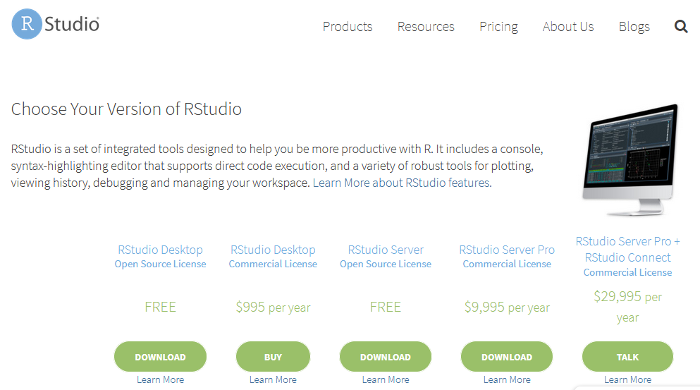

```{r setup, include=FALSE}
options(htmltools.dir.version = FALSE, scipen = 999)
knitr::opts_chunk$set(eval = FALSE)
```

# Become a UseR

--

**Efficiency**

* Point-and-click software just isn't time efficient

* Automating tasks will pay off within the time frame of a PhD and thereafter

--

**Reproducibility**

* There is an increasing expectation that materials, data, and analysis details are provided alongside research to ensure it is reproducible

* This is easier when things are script based

--

**Jobs**

* R is increasingly taught in Psychology departments, including at undergraduate level

* Useful skill for jobs outside academia

* Makes you a more efficient academic

---

# A journey as UseR

R is not only about coding, it is also about yourself

--

**Be resilient**
 * Mistakes and errors are a part of the deal, learn to be problem-solving focused 

--

**Be perseverant**
  * Nothing is unsolvable, the answer to your problem is out there, you just have to find it

--

**Be open**
  * The R community is friendly because we all know how difficult the first steps are

---
class: center, middle

# It's time to rumble!

---

# How to install R

* If you have your own computer with administrator access:
  * Install "Base" R from CRAN https://cran.r-project.org/
  * Install RStudio https://www.rstudio.com/products/rstudio/download/

* If you don't have administrator access:
  * Register to https://rstudio.cloud

.pull-left[


*CRAN to install Base R*
]

.pull-right[


*RStudio to install R IDE*
]

---

# RStudio IDE

Made of 4 panels:
* **Console**: where the results are printed
* **Code Editor**: where you have to write your code
* **Workspace**: where the objects are stored
* **Files, Plots, Package, Help and Viewer**: where datascience materials are

<p style="text-align:center;">
---

# From Science to Data Science in 4 clicks

* In RStudio IDE

  * Tools > Global Options ... > Appearance 
  * Scroll down to "Vibrant Ink" and click Apply > OK
  
---

<p style="text-align:center;">**Welcome to ...**

--
background-image: url(https://media2.giphy.com/media/10zxDv7Hv5RF9C/giphy.gif?cid=3640f6095c7801104a4c3632591e5e42)

---

background-image: url(./img/rusers.jpg)
background-size: contain

---

# What is R?

* R is a programming language

* R is object oriented 
  * **Arrow assigment** to create objects: `<-`

Some examples of assigment:

```{r}
numerics <- 2

characters <- "two"

vectors <- c(2,"two")

arrays <- 1:2

dataframes <- data.frame(col1 = c("one","two"), col2 = c(1,2))

functions <- function(x){x^2}

plots <- ggplot(data = dataframes, aes(x = col1, y = col2)) +
  geom_point()
```

---

# What is R?

R is a case-sensitive language, x and X do not refer to the same object

Object names:
- can be created using letters, digits and some special characters ( _ and . but not -)
- must not start with a digit or a . followed by a digit.
- avoid names already used by the system, e.g. c, q, t, C, D, F, I, T, diff, ...)

Be carefull, R doen't save objects, you have to save the code to recreate them everytime.

---

# How does R work?

Users enter a line with a command after the prompt and press `Enter`.

The programme carries out the command and prints the result if relevant. For example, if the expression 2 + 2 is typed in, the following is printed in the R console:

```{r}
2 + 2
```

<mark>The prompt `>` indicates that R is ready for another command</mark>  
* <mark>If a command is incomplete at the end of a line, the prompt + is displayed</mark> on subsequent lines until the command is syntactically complete

```{r eval=FALSE}
test <- data.frame(x = rnorm(10000000), y = rnorm(10000000)
```

* If the console shows a <mark>red icone in the top right corner, the console is currently processing your script</mark>

```{r eval=FALSE}
test <- data.frame(x = rnorm(10000000), y = rnorm(10000000))

summary(lm(y~x, test))
```


* If the shows a <mark>red "stop" button, your code has produced an error and you need to click on it to exit the debbug mode</mark>

---


---

# R keyboard short cuts and syntax

--

Short cuts

* `Ctl + Enter` : process line
* `Alt + -` : insert arrow (<-)
* `Ctl + L` : clear console

--

Syntax

* `#` to comment a line
  * used to explaine the what and why of the code
  * used to disable a code line (can be done with Ctl+Maj+C)
  
* `?keyword` looks for help in the packages in use
* `??keyword` looks for help in all the packages installed

---

# Object Classes

* numeric
   * 2, 5.3, 10^2

* character
  * "one", "One", "ONE"

* boolean
  * TRUE and FALSE

---

# Basic Operators

* Arithmetic Operators include:

|Operator |Description             |
|---------|------------------------|
|+        |addition                |
|-        |subtraction             |
|*        |multiplication          |
|/        |division                |
  
* Arithmetic Operators include:

|Operator |Description             |
|---------|------------------------|
|> and <  |greater than            |
|>= and <=|greater than or equal to|
|==       |exactly equal to        |
|!=       |not equal to            |

---

# Basic Examples Using operators

```{r}
2

2 + 3 

2 > 3
```

---

# Basic Examples Using Assigment

```{r}
numeric_two <- 2 # value 2 assigned to numeric_two object
numeric_two

numeric_three <- 3 # value 3 assigned to numeric_three object
numeric_three

numeric_two + numeric_three

character_two <- "Two" # character "Two" assigned to character_two object
character_two
```

# Whoops

```{r, error=TRUE}
character_two + numeric_three
```

---

# Using Functions

Functions are transforming object by diffining their arguments

Have a look at our first function:

```{r}
?c

# Description: This is a generic function which combines its arguments.
# Examples
# c(1,7:9)
# c(1:5, 10.5, "next")
```

Most usefull functions

```{r}
install.package("PackageName")

library(PackageName)

getwd()
setwd("C:/path/to/your/folder")

str(ObjectName)
```

WARNING: path in R are using UNIX system so Apple and Linux users are fine but Windows users have to replace `\` by `/` in any path.

---

# Using Packages

Functions are implemented in Package

* Some packages are already installed by default (e.g., base, stats, ...)

* Most of them have to be downloaded 
    * From CRAN
    * From GitHub
    
Example of packages very useful
- dplyr and tidyr for data wrangling
- ggplot2 for data visualisation
- leveen for SEM analysis
- ...

To access all of the functions a particular package, it must be downloaded once and loaded into the workspace each time you are starting a new session. For example, to load the dplyr package:

```{r}
install.package("dplyr") # once

library(dplyr) # at the begining of each script to be loaded every new session
```

---
class: center, middle

# Most Useful Objects

---

# Basic Objects

* Vector

* Factor

* Array

* Matrix

* Data Frame

* List

---

# Vectors

Vectors are the simplest type of object in R. There are 3 main
types of vectors:
* Numeric vectors
* Character vectors
* Boolean vectors
* Complex vectors

```{r}
numeric_vector <- c(10.4, 5.6, 3.1, 6.4, 21.7) # Numeric vector
numeric_vector

character_vector <- c("one", "two", "three") # Character vector
character_vector

boolean_vector <- c(TRUE, FALSE, TRUE) # Boolean vector
boolean_vector

heterogenous_vector <- c("one", 2, TRUE) # Heterogenous vector
heterogenous_vector
```

* Missing Values

In some cases the entire contents of a vector may not be known. For example, missing data from a particular data set. A place can be reserved for this by assigning it the special value NA.

---
# Indexing and Modifying Vectors

To access to a specific value (also called indexing) use `ObjectName[number]`

```{r}
numeric_vector[1]

character_vector[3]
```

To alter the contents of a vector, similar methods can be used.

```{r eval=FALSE}
# For example, to modify the 1st element of numeric_vector and assign it a value 5
numeric_vector[1] <- 5
numeric_vector
```

---

# Factors

A factor is a special type of vector used to represent character data (e.g. gender, social class, etc.) ordered according to numerical values

```{r}
character_vector

character_vector <- as.factor(character_vector)

character_vector
```

Example

>Consider a survey that has data on 200 females and 300 males. If the first 200 values are from females and the next 300 values are from males, one way of representing this is to create a vector

```{r}
# Vector of characters
gender <- c(rep("female", 200), rep("male", 300))
# To change this into a factor
gender <- as.factor(gender) 
# The factor gender is stored as 1 female and 2 male called a level of the factor.

# To determine the levels of a factor the function levels() can be used:
levels(gender)
```

---

# Array

Is the the case of vector made of numeric values

---

# Matrix

A matrix is a two-dimensional array of numbers, it has rows and columns

In R matrices are represented as vectors with dimensions.

```{r}
m <- rnorm(12) # Creates a vector of 12 random numbers
m

matrix(m, nrow=3, ncol=4, byrow=T) 
# Causes R to treat the vector of 12 numbers as a 3 x 4 matrix.
```

---

# DataFrame

The most important object in R!

DataFrame are spreedsheet made of rows and columns

Columns can have different class (e.g., character columns and numeric columns)

```{r}
dataframes <- data.frame(col1 = c("one","two"), col2 = c(1,2))
dataframes
```

Values from dataframe can be accessed using `DataframeName[RowNumber,ColNumber]`

```{r}
dataframes[1,1] 
# gives the value in the 1st row and 1st column of "dataframes" object

dataframes[2,1] 
# gives the value in the 2nd row and 1st column of "dataframes" object

dataframes[1,2] 
# gives the value in the 1st row and 2nd column of "dataframes" object
```

Columns from dataframe can be accessed using `DataframeName$ColName`

```{r}
dataframes$col1

dataframes$col2
```

---

# Indexing Data Frames

By leaving row or column number empty you select all the values for the row or column indicated.

```{r}
dataframes[2,] 
# returns all the columns value for the 2nd row

dataframes[,2] 
# returns all the rows in the 2nd column (same as using dataframes$col2)
```

---

# Lists

Lists are an ordered collection of object which can have different classes

```{r}
lists <- list(name="Fred", wife="Mary", no.children=3, child.ages=c(4,7,9)) 
# list of 4 objects
```

>In general you don't want to deal with lists because they are very difficult to handle

---
class: center, middle

# Read and Save Data

---

# How to use external data

Dataframe objects (object type spreedsheet containing data) can be 
* Created in R
* Uploaded from an external file

If the dataframe is uploaded from an external file you can 
* Use R studio IDE with the `Files` panel (for beginners)
* Use a funtion to read the type of file (natural way)

The function use depend on the type of file

```{r}
text_file <- read.delim("C:/path/to/your/file.txt") 
# create dataframe object from a text file

csv_file <- read.csv("C:/path/to/your/file.csv") 
# create dataframe object from a csv file
```

Note on file types: always try to save to .csv which is the most common data file type. So avoid to upload .xls/.xlsx files or even spss files

---

# How to save data 

Saving in RStudio IDE is only for script documents in .R format. To save data from dataframe object you have to use a dedicated function like `write.csv()` with several arguments:
* x : the object to be written
* file : the path where the object has to be written with object name and extension
* row.names : a logical value (TRUE or FALSE) indicating whether the row names of x are to be written along with x

```{r}
dataframes <- data.frame(col1 = c("one","two"), col2 = c(1,2))

write.csv(
  x = dataframes, 
  file = "C:/path/to/object/dataframes.csv", 
  row.names = FALSE)
```

---

# How to solve your pRoblems

1. Look at your error
  * If it's obvious, solve it by yourself
  * If it's not obvious, copy paste the error in google
  
2. Look at your object (`str(ObjectName)`)

3. Look at the function (documentation)

4. Look at the web
  * Google "R how to ..."
  * Stack Overflow

---
class: center, middle

# Your are now a UseR!