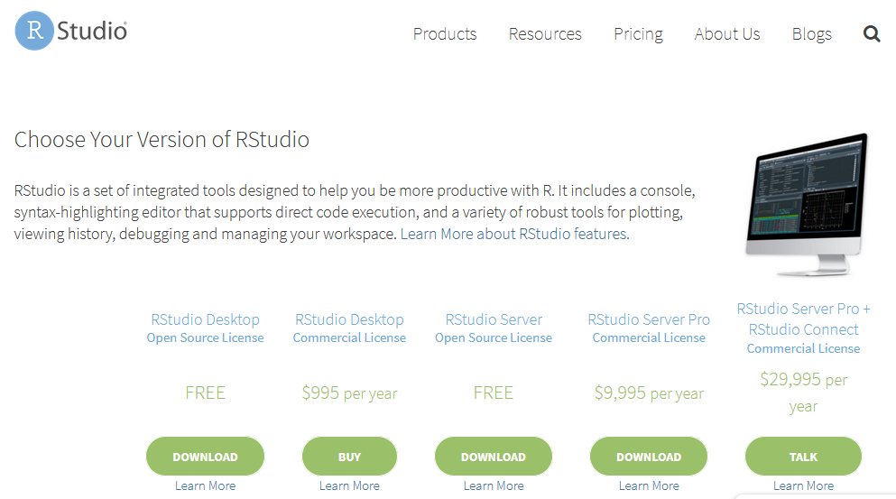

```{r setup, include=FALSE}
options(htmltools.dir.version = FALSE, scipen = 999)
knitr::opts_chunk$set(eval = FALSE)
```

# Become a UseR

--

**Efficiency**

* Point-and-click software just isn't time efficient

* Automating tasks will pay off within the time frame of a PhD and thereafter

--

**Reproducibility**

* There is an increasing expectation that materials, data, and analysis details are provided alongside research to ensure it is reproducible

* This is easier when things are script based

---

# How to install R

* If you have your own computer with administrator access:
  * Install "Base" R from CRAN https://cran.r-project.org/
  * Install RStudio https://www.rstudio.com/products/rstudio/download/

* If you don't have administrator access:
  * Register to https://rstudio.cloud

.pull-left[


*CRAN to install Base R*
]

.pull-right[


*RStudio to install R IDE*
]

---

# RStudio IDE

Made of 4 panels:
* **Console**: where the results are printed
* **Code Editor**: where you have to write your code
* **Workspace**: where the objects are stored
* **Files, Plots, Package, Help and Viewer**: where datascience materials are

<p style="text-align:center;">
---

# From Science to Data Science in 4 clicks

* In RStudio IDE

  * **Tools** > **Global Options ... ** > **Appearance** 
  * Scroll down to **Vibrant Ink** and click **Apply** > **OK**
  
---

<p style="text-align:center;">**Welcome to ...**

--
background-image: url(https://media2.giphy.com/media/10zxDv7Hv5RF9C/giphy.gif?cid=3640f6095c7801104a4c3632591e5e42)

---

# What is R?

* R is a programming language

* R is object oriented 
  * **Arrow assigment** to create objects: `<-`

--

Some examples of assigment:

```{r}
numerics <- 2

characters <- "two"

vectors <- c(2,"two")

arrays <- 1:2

dataframes <- data.frame(col1 = c("one","two"), col2 = c(1,2))

functions <- function(x){x^2}

plots <- ggplot(data = dataframes, aes(x = col1, y = col2)) +
  geom_point()
```

--

* Short cuts
  * `Ctl + Enter` : process line
  * `Alt + dash` : insert arrow (<-)

---

# How does R work?

Users write a line in a script and press `Crtl` + `Enter`.

--

Check the status of the console:

* The prompt `>` indicates that R is ready for another command

--

* The prompt `+` indicates that R is waiting for a code to close the line

```{r eval=FALSE}
test <- data.frame(x = rnorm(10000000), y = rnorm(10000000)
# Error because it needs a closing bracket
```

--

* No prompt with red icone in the top right corner indicates that R is processing your script

```{r eval=FALSE}
test <- data.frame(x = rnorm(10000000), y = rnorm(10000000))

summary(lm(y~x, test))
```

--

* The prompt `Browse[]>` with a red "stop" button indicates that your code has produced an error and you need to click on it to exit the debbug mode

---


---

# Object Classes

* numeric
   * 2, 5.3, 10^2

* character
  * "one", "One", "ONE"

* boolean
  * TRUE and FALSE

---

# Basic Operators

* Arithmetic Operators include:

|Operator |Description             |
|---------|------------------------|
|+        |addition                |
|-        |subtraction             |
|*        |multiplication          |
|/        |division                |
  
* Arithmetic Operators include:

|Operator |Description             |
|---------|------------------------|
|> and <  |greater than            |
|>= and <=|greater than or equal to|
|==       |exactly equal to        |
|!=       |not equal to            |

---

# Basic Examples Using Assigment

```{r}
numeric_two <- 2 # value 2 assigned to numeric_two object
numeric_two

numeric_three <- 3 # value 3 assigned to numeric_three object
numeric_three

numeric_two + numeric_three

character_two <- "Two" # character "Two" assigned to character_two object
character_two
```

# Whoops

```{r, error=TRUE}
character_two + numeric_three
```

---

# Using Functions

* Functions are transforming object by diffining their arguments

--

* Functions are stored in a package 

```{r}
install.package("PackageName") # Once

library(PackageName) # Every time you start R

NewObject <- FunctionName()
```

--

* Functions can be called without loading the package

```{r}
NewObject <- PackageName::FunctionName()
```

--

* Functions have arguments which can be explicit or implicit

```{r}
NewObject <- PackageName::FunctionName(arg1 = x, arg2 = y)
# Or
NewObject <- PackageName::FunctionName(x, y)
```

Note: Arguments' order is important

---

# Using Packages

* Some packages are already installed by default (e.g., base, stats, ...)

* Most of them have to be downloaded 
    * From CRAN
    * From GitHub
    
To access all of the functions a particular package, it must be downloaded once and loaded into the workspace each time you are starting a new session. For example, to load the dplyr package:

```{r}
install.package("dplyr") # once

library(dplyr) # at the begining of each script to be loaded every new session
```

---
class: center, middle

# Most Useful Objects

---

# Basic Objects

* Vector

* Factor

* Array

* Matrix

* Data Frame

* List

---

# Vectors

... are objects containing multiple values. 

There are 3 main types of vectors:

```{r}
numeric_vector <- c(10.4, 5.6, 3.1, 6.4, 21.7) # Numeric vector
numeric_vector

character_vector <- c("one", "two", "three") # Character vector
character_vector

boolean_vector <- c(TRUE, FALSE, TRUE) # Boolean vector
boolean_vector

# Warning
heterogenous_vector <- c("one", 2, TRUE) # Heterogenous vector
heterogenous_vector
```

Note: Missing Values are `NA`

---

# Factors

... are ordered character vectors (e.g. gender, social class, etc.).

*Example*

>Consider a survey that has data on 200 females and 300 males. If the first 200 values are from females and the next 300 values are from males, one way of representing this is to create a vector

```{r}
# Vector of characters
gender <- c(rep("female", 200), rep("male", 300))
# To change this into a factor
gender <- as.factor(gender) 
# The factor gender is stored as 1 female and 2 male called a level of the factor.

# To determine the levels of a factor the function levels() can be used:
levels(gender)
```

---

# Arrays

... are numeric vectors.

and 

# Matrices

... are two-dimensional arrays (i.e. with rows and columns).


```{r}
m <- rnorm(12) # Creates a vector of 12 random numbers
m

matrix(m, nrow=3, ncol=4, byrow=T) 
# Causes R to treat the vector of 12 numbers as a 3 x 4 matrix.
```

---

# Data Frames

... are the most important object in R!

DataFrames are matrices which columns have different classes

```{r eval = TRUE}
dataframes <- data.frame(col1 = c("one","two"), col2 = c(1,2))
dataframes
```

--

Values from dataframes can be accessed using `DataframeName[RowNumber,ColNumber]`

```{r}
dataframes[1,1] 

dataframes[2,1] 

dataframes[1,2] 
```

--

Columns from dataframes can be accessed using `DataframeName$ColName`

```{r}
dataframes$col1

dataframes$col2
```

---

# Lists

... are a collection of objects with different classes

```{r}
lists <- list(
  name="Fred", 
  wife="Mary", 
  no.children=3, 
  child.ages=c(4,7,9)
  ) 
```

>In general you don't want to deal with lists because they are very difficult to handle

---
class: center, middle

# Read and Save Data

---

# How to use external data

To upload data in RStudio
* Use R studio IDE with the `Files` panel (for beginners)
* Use a funtion to read the type of file (natural way)

The function used depends on the type of file:

```{r}
text_file <- read.delim("C:/path/to/your/file.txt") 

csv_file <- read.csv("C:/path/to/your/file.csv") 
```

Note: always try to save to .csv which is the most common data file format. Avoid Excel and SPSS file format. 

Warning: path in R are using UNIX system so Apple and Linux users are fine but Windows users have to replace `\` by `/` in any path.

---

# How to save data 

Saving in RStudio IDE is only for script documents in .R format. 

Use a dedicated function like `write.csv()` with the following arguments:
* x : the object to be written
* file : the path where the object has to be written with object name and extension

```{r}
dataframes <- data.frame(col1 = c("one","two"), col2 = c(1,2))

write.csv(
  x = dataframes, 
  file = "C:/path/to/object/dataframes.csv")
```

---

# How to solve your pRoblems

1. Look at your error
  * If it's obvious, solve it by yourself
  * If it's not obvious, copy paste the error in google
  
--
  
2. Look at your object (`str(ObjectName)`)

--

3. Look at the function (function documentation)

--

4. Look at the web
  * Google "R how to ..."
  * Stack Overflow

---
class: center, middle

# Your are now a UseR!